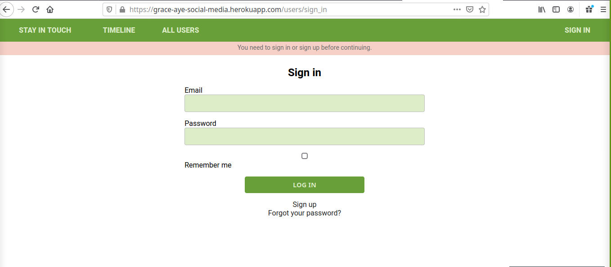

# Scaffold for social media app with Ruby on Rails

> In this project we developed a full flesh social media application from modelling the entity relationship diagram (ERD) to building the needed ActiveRecords.

Some of the advanced concepts explored in this project includes.
- Working with advanced associations, many-to-many relationships.
- Using RSpec testing using shoulda-matchers and capybara



## Built With

- Ruby v2.7.1
- Ruby on Rails v5.2.4

## Live Demo
[Live Link](https://grace-aye-social-media.herokuapp.com/)


## Getting Started

To get a local copy up and running follow these simple example steps.

### Prerequisites

- Ruby: 2.7.1
- Rails: 5.2.4
- Postgres: >= 0.18

### Setup

$ git clone https://github.com/GraceOyiza/ror-social-scaffold.git

$ cd ror-social-scaffold

Instal gems with:

```
bundle install
```

Setup database with:

- make sure you have postgress sql installed and running on your system
```
   rails db:create
   rails db:migrate
```

### Usage

Start server with:

```
    rails server
```

Open `http://localhost:3000/` in your browser.

### Run tests

```
    rpsec --format documentation
```

## Author Details::

👤 **Popoola Grace Boluwatife**

- Github: [Github](https://github.com/GraceOyiza)
- Twitter: [Twitter](https://twitter.com/_PopsonGrace)
- E-mail: <a href="mailto:graceoyiza13@gmail.com?subject=Hello Grace!">Email</a>
- LinkedIn: [Linkedin](https://www.linkedin.com/in/grace-popoola)

👤 **Aye Daniel A**

- Github: [Github](https://github.com/Alaska01)
- Twitter: [Twitter](https://twitter.com/AyeAsoo)
- E-mail: <a href="mailto:aadaniel108@gmail.com?subject=Hello Daniel!">Email</a>  
- Linkedin: [Linkedin](https://www.linkedin.com/in/daniel-asoo-aye/)


## 🤝 Contributing

Contributions, issues and feature requests are welcome!

Feel free to check the [issues page](issues/).

## Show your support

Give a ⭐️ if you like this project!

## Acknowledgments

TBA

## 📝 License

TBA

